# 🚀 SigNoz Monitoring Platform on AWS

A production-ready observability platform deployed on AWS using Terraform, Docker, and SigNoz. This project automates the provisioning of cloud infrastructure and provides comprehensive monitoring for applications, APIs, logs, metrics, and distributed traces through OpenTelemetry.

---

## 📌 Project Overview

Monitoring is a critical part of modern cloud-native applications. This project deploys a self-hosted SigNoz monitoring stack on AWS EC2 using Infrastructure as Code (IaC) principles.

The entire infrastructure and deployment process is automated using Terraform and Docker Compose, enabling quick, repeatable, and scalable deployments.

---

## ✨ Features

* 📊 Application Performance Monitoring (APM)
* 🔍 Distributed Tracing with OpenTelemetry
* 📈 Infrastructure Monitoring (CPU, Memory, Disk, Network)
* 🌐 API Monitoring
* 📝 Centralized Log Management
* 🚨 Alert Management
* ☁️ Automated AWS Infrastructure Provisioning
* 🔐 Secure Instance Access via AWS Systems Manager (SSM)
* 🐳 Containerized Deployment using Docker Compose
* 🔄 Fully Reproducible Infrastructure with Terraform

---
## 📸 Screenshots

| Infrastructure | Login |
|---------------|-------|
| 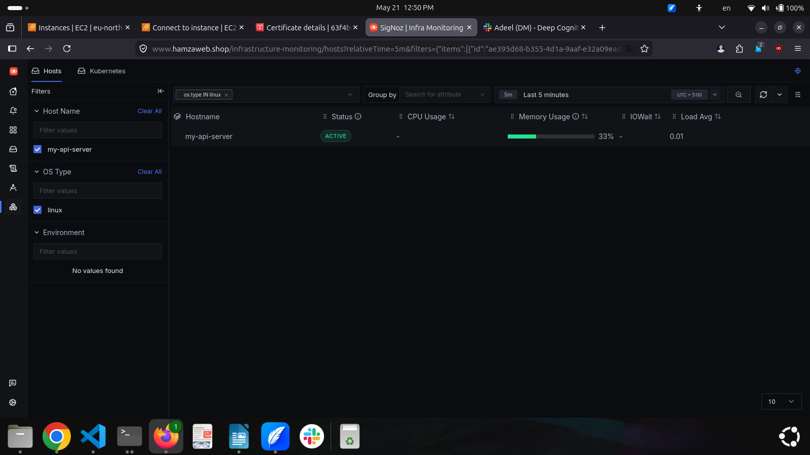 | 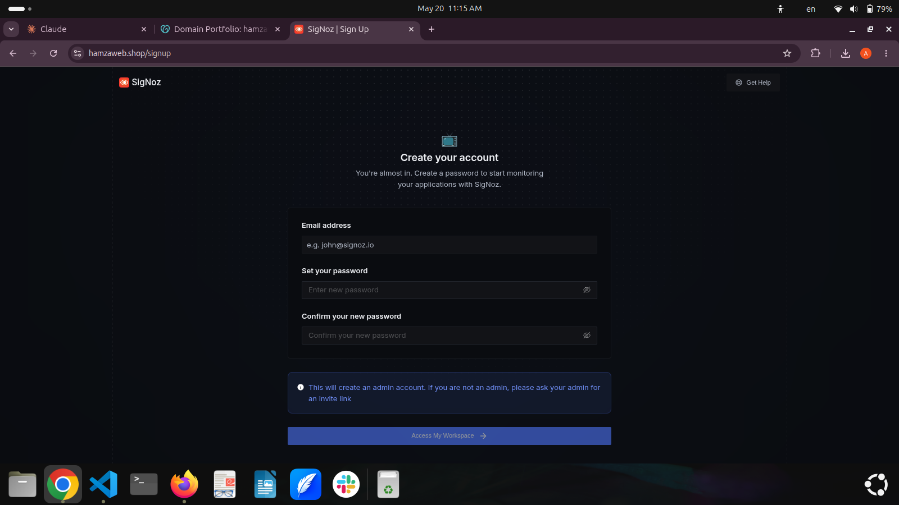 |

| Dashboard | Server Monitoring |
|-----------|-------------------|
| 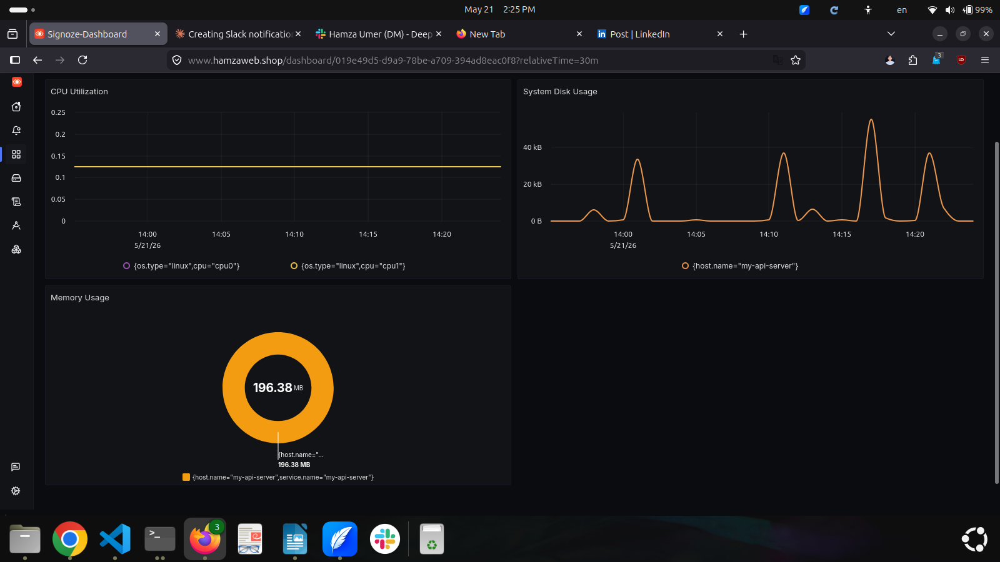 | 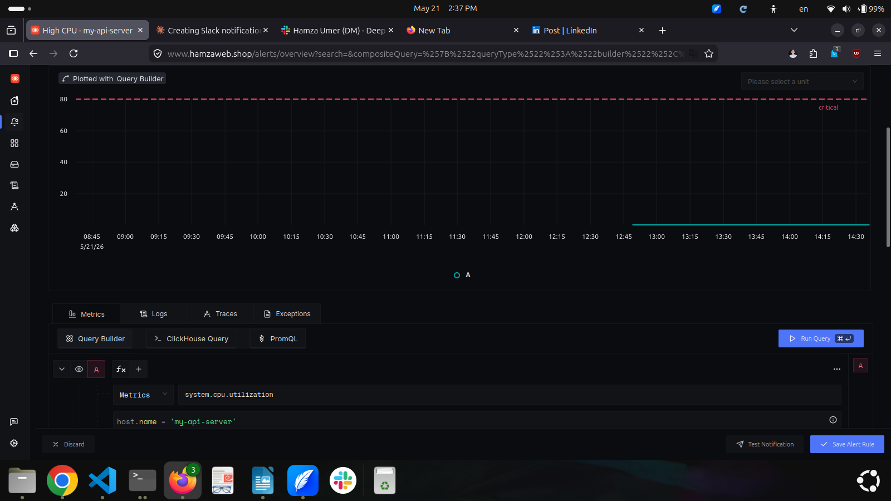 |

| Memory Usage | Resource Usage |
|--------------|----------------|
| 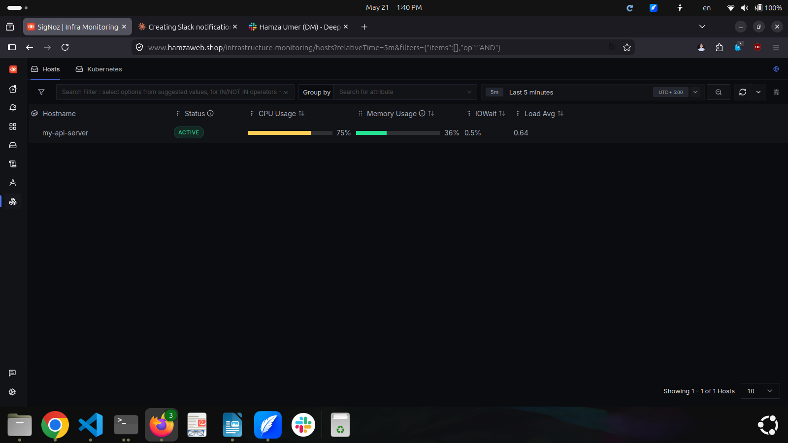 | 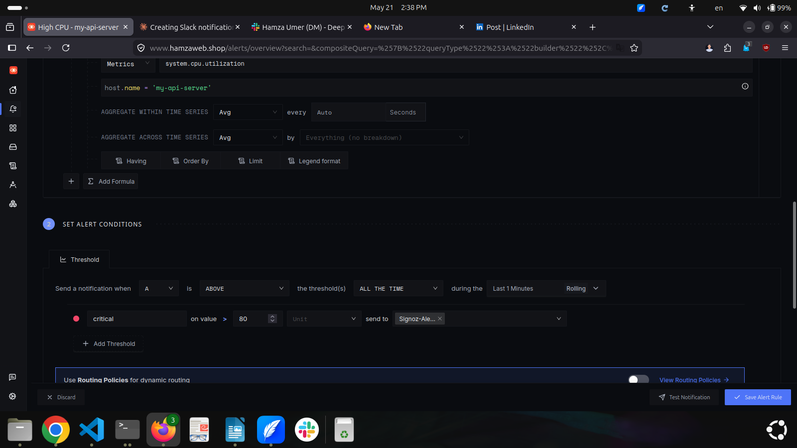 |

| Cloud Resources | Hosts |
|-----------------|-------|
| 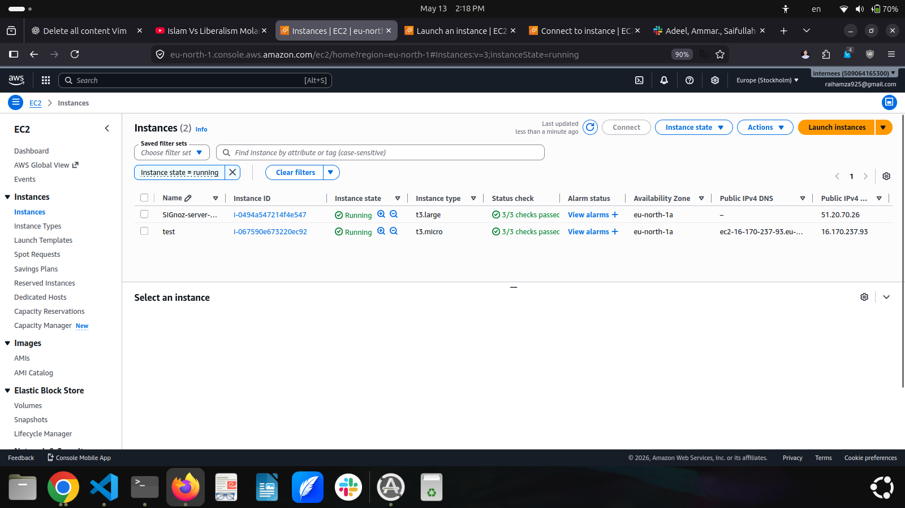 | 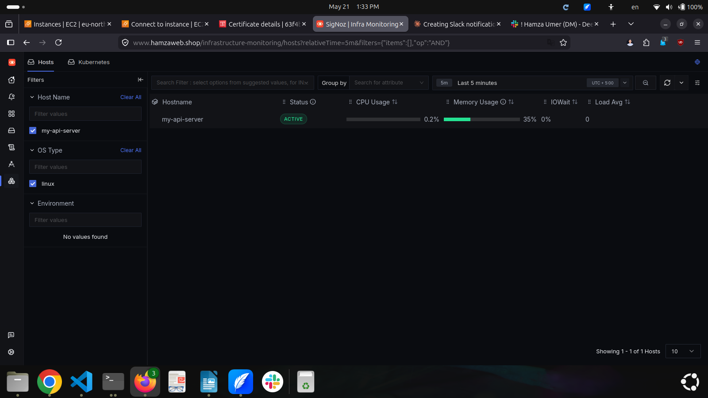 |

| Alert Setup | Email Alert |
|-------------|-------------|
| 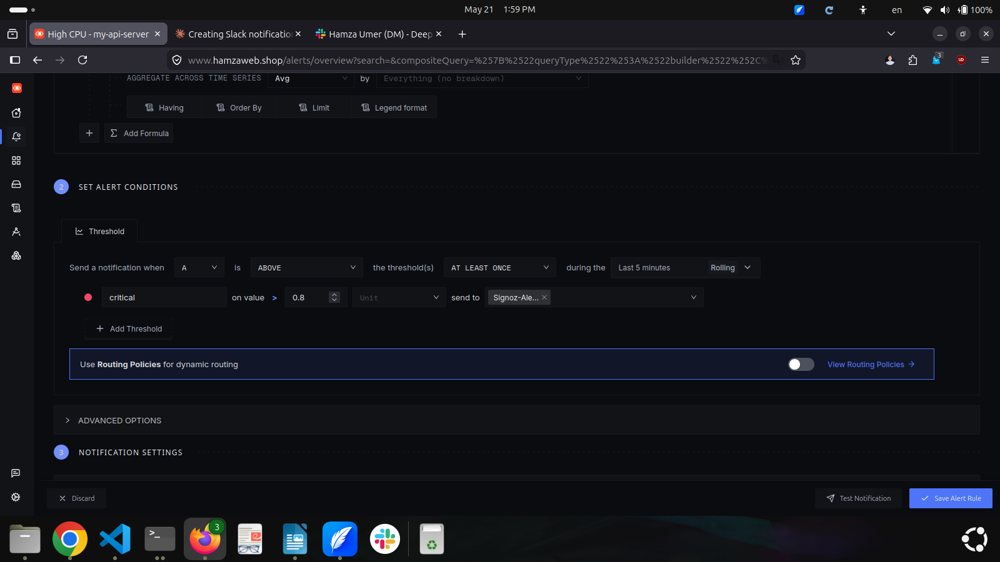 | 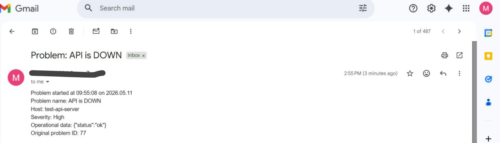 |

| Active Alert |
|--------------|
| 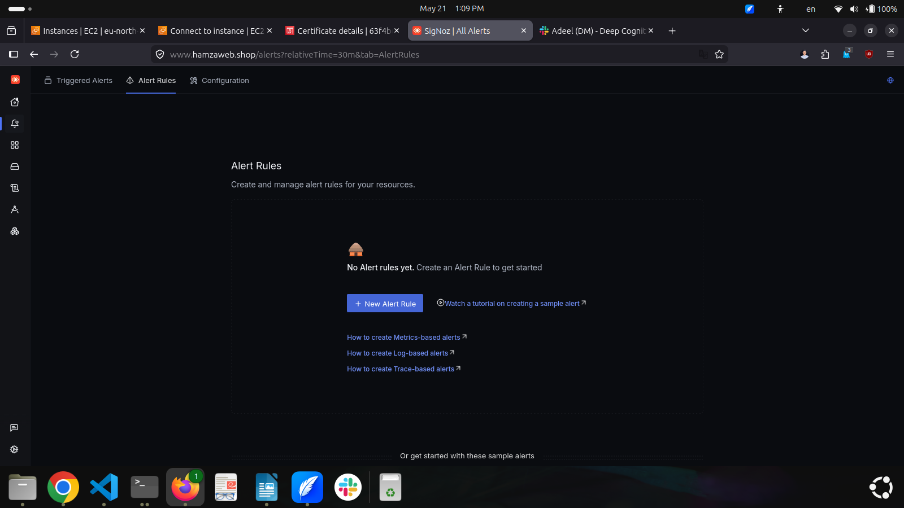 |

 ---

## 🏗️ Architecture

```text
                    ┌─────────────────┐
                    │   Applications  │
                    └────────┬────────┘
                             │
                             ▼
                    OpenTelemetry
                             │
                             ▼
                 ┌──────────────────┐
                 │ OTel Collector   │
                 └────────┬─────────┘
                          │
                          ▼
                 ┌──────────────────┐
                 │    SigNoz        │
                 │ Query Service    │
                 └────────┬─────────┘
                          │
                          ▼
                 ┌──────────────────┐
                 │   ClickHouse     │
                 │   Database       │
                 └──────────────────┘

                          │
                          ▼
                 ┌──────────────────┐
                 │  SigNoz UI       │
                 └──────────────────┘
```

---

## 🛠️ Technology Stack

### Infrastructure

* Terraform
* AWS EC2
* AWS VPC
* AWS Security Groups
* AWS IAM
* AWS Systems Manager (SSM)

### Monitoring Stack

* SigNoz
* OpenTelemetry Collector
* ClickHouse
* Alertmanager
* ZooKeeper

### Containerization

* Docker
* Docker Compose

---

## 📂 Project Structure

```text
signoz-monitoring/
├── main.tf
├── variables.tf
├── output.tf
├── terraform.tfvars
├── user_data.sh
├── signoz-compose-file/
│   └── docker-compose.yml
└── README.md
```

---

## 🚀 Deployment

### Initialize Terraform

```bash
terraform init
```

### Review Infrastructure Plan

```bash
terraform plan
```

### Deploy Infrastructure

```bash
terraform apply
```

### Access SigNoz Dashboard

```text
http://<EC2-PUBLIC-IP>:3301
```

---

## 📊 Monitoring Capabilities

### Infrastructure Metrics

* CPU Usage
* Memory Usage
* Disk Utilization
* Network Traffic

### Application Metrics

* Request Rate
* Response Time
* Error Rate
* Throughput

### Observability

* Logs
* Metrics
* Traces
* Alerts

---

## 🔮 Future Enhancements

* HTTPS with Nginx Reverse Proxy
* Route53 Domain Integration
* SSL/TLS using Let's Encrypt
* Multi-Environment Support
* EKS Deployment
* Automated Backup Strategy
* CI/CD Integration with GitHub Actions

---

## 🎯 Learning Outcomes

This project demonstrates practical experience with:

* Terraform Infrastructure as Code
* AWS Cloud Services
* Docker & Containerization
* OpenTelemetry
* Observability Engineering
* Monitoring & Alerting
* DevOps Best Practices
* Production Deployment Workflows

---

## 👨‍💻 Author

**Hamza Umer**

* DevOps Engineer
* AWS Enthusiast
* Infrastructure Automation Learner

LinkedIn:
https://www.linkedin.com/in/hamza-umer-b7673a277

---

⭐ If you found this project useful, consider giving it a star.
